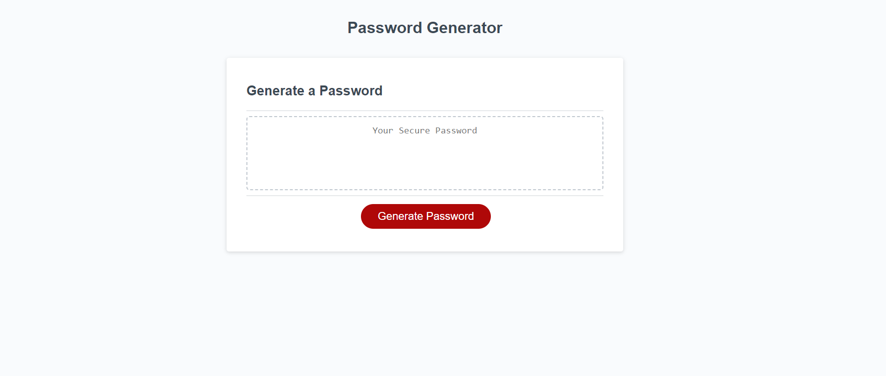

# modify-random-password-generator-
Modify the code of the random password generator.

## Description

The random password generator had starter code in the script.js, but it was incomplete. The HTML and CSS sheet were already completed. The task was to make sure a password could be generated based on criteria picked by the user. The password criteria included the password length, and whether or not the password would include lowercase letters, uppercase letters, numbers, and/or special characters. Through this process, the largest challenge was formatting the conditionals for each confirm method. Once I figured out the first one, I used it for the following methods and it worked. With the code completed, people can now use this to create a randomly generated password with their choice of criteria. 

## Credits
I used this [YouTube](https://www.youtube.com/watch?v=x4HUaiazDes) video to help me set up my pseudo code. 